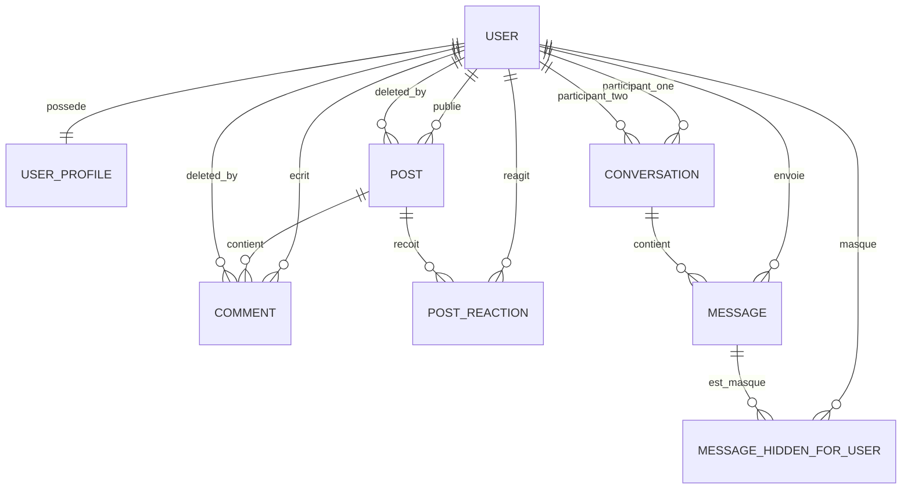
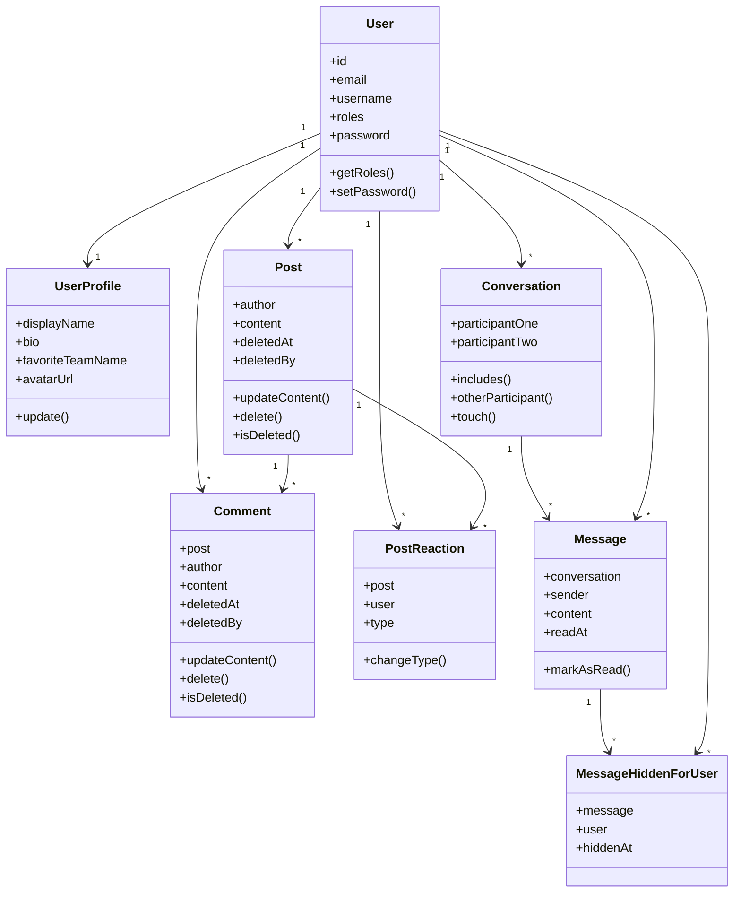
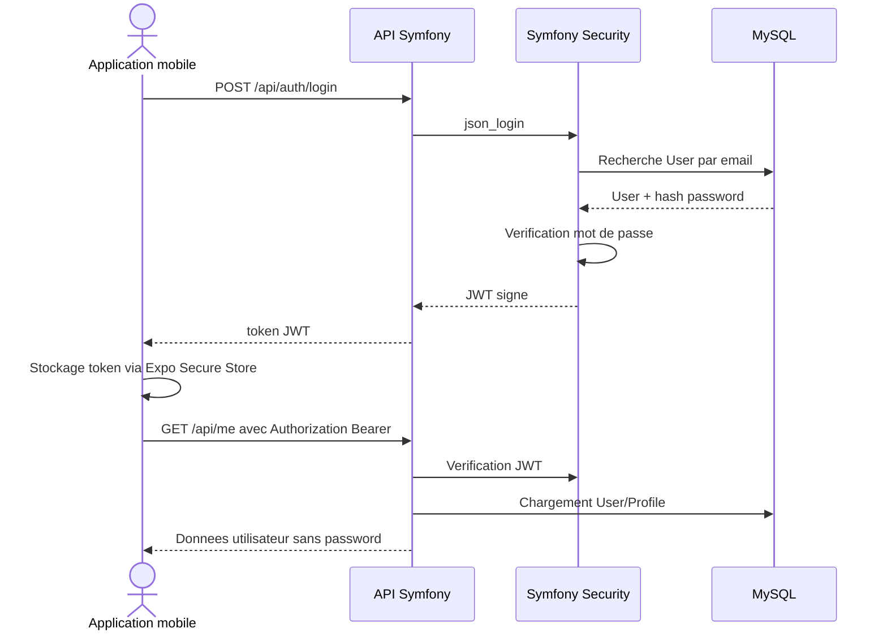
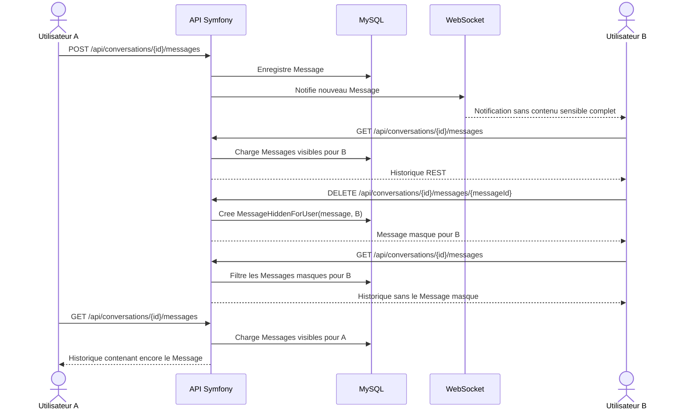

# Base De Donnees

## Objectif

Ce document decrit le modele de donnees relationnel de LeKlub pour le dossier projet CDA.

La base MySQL est geree par Doctrine ORM et versionnee par migrations. Les entites principales se trouvent dans `backend/src/Domain/Entity` et les migrations dans `backend/migrations`.

Le modele est volontairement simple, normalise raisonnablement et adapte au MVP :

- utilisateurs et profils ;
- feed social avec Posts, Commentaires et Reactions ;
- messagerie privee entre deux utilisateurs ;
- masquage d'un Message prive pour soi uniquement ;
- moderation par suppression logique des contenus publics.

## Entites Principales

| Entite | Table | Role |
| --- | --- | --- |
| `User` | `user` | Compte applicatif, authentification, roles |
| `UserProfile` | `user_profile` | Informations publiques et modifiables du profil |
| `Post` | `post` | Publication texte du feed |
| `Comment` | `feed_comment` | Commentaire rattache a un Post |
| `PostReaction` | `post_reaction` | Like ou dislike d'un utilisateur sur un Post |
| `Conversation` | `conversation` | Conversation privee entre deux utilisateurs |
| `Message` | `message` | Message prive rattache a une Conversation |
| `MessageHiddenForUser` | `message_hidden_for_user` | Masquage d'un Message pour un utilisateur donne |

## Modele Conceptuel Simplifie



## Schema Relationnel Simplifie

```mermaid
erDiagram
    USER {
        int id PK
        varchar email UK
        varchar username UK
        json roles
        varchar password
        datetime created_at
        datetime updated_at
    }

    USER_PROFILE {
        int id PK
        int user_id FK UK
        varchar display_name
        varchar bio
        varchar favorite_team_name
        varchar avatar_url
        datetime created_at
        datetime updated_at
    }

    POST {
        int id PK
        int author_id FK
        longtext content
        datetime created_at
        datetime updated_at
        datetime deleted_at
        int deleted_by_id FK
    }

    FEED_COMMENT {
        int id PK
        int post_id FK
        int author_id FK
        longtext content
        datetime created_at
        datetime updated_at
        datetime deleted_at
        int deleted_by_id FK
    }

    POST_REACTION {
        int id PK
        int post_id FK
        int user_id FK
        varchar type
        datetime created_at
        datetime updated_at
    }

    CONVERSATION {
        int id PK
        int participant_one_id FK
        int participant_two_id FK
        datetime created_at
        datetime updated_at
    }

    MESSAGE {
        int id PK
        int conversation_id FK
        int sender_id FK
        longtext content
        datetime read_at
        datetime created_at
    }

    MESSAGE_HIDDEN_FOR_USER {
        int id PK
        int message_id FK
        int user_id FK
        datetime hidden_at
    }

    USER ||--|| USER_PROFILE : user_id
    USER ||--o{ POST : author_id
    USER ||--o{ POST : deleted_by_id
    POST ||--o{ FEED_COMMENT : post_id
    USER ||--o{ FEED_COMMENT : author_id
    USER ||--o{ FEED_COMMENT : deleted_by_id
    USER ||--o{ POST_REACTION : user_id
    POST ||--o{ POST_REACTION : post_id
    USER ||--o{ CONVERSATION : participant_one_id
    USER ||--o{ CONVERSATION : participant_two_id
    CONVERSATION ||--o{ MESSAGE : conversation_id
    USER ||--o{ MESSAGE : sender_id
    MESSAGE ||--o{ MESSAGE_HIDDEN_FOR_USER : message_id
    USER ||--o{ MESSAGE_HIDDEN_FOR_USER : user_id
```

## Relations Et Cardinalites

### Utilisateur Et Profil

- Un `User` possede un seul `UserProfile`.
- Un `UserProfile` appartient a un seul `User`.
- La relation est obligatoire cote `UserProfile`.
- La suppression d'un `User` supprime son profil via `ON DELETE CASCADE`.

### Feed

- Un `User` peut publier plusieurs `Post`.
- Un `Post` appartient a un seul auteur.
- Un `Post` peut recevoir plusieurs `Comment`.
- Un `Comment` appartient a un seul `Post` et a un seul auteur.
- Un `Post` peut recevoir plusieurs `PostReaction`.
- Un `User` ne peut avoir qu'une seule reaction par `Post`.

### Moderation

- Les `Post` et `Comment` ne sont pas supprimes physiquement.
- Ils utilisent une suppression logique :
  - `deleted_at` indique la date de suppression ;
  - `deleted_by_id` indique l'utilisateur ou l'admin qui a realise la suppression.
- Les contenus supprimes sont exclus du feed et des details publics.

### Messagerie Privee

- Une `Conversation` relie deux utilisateurs :
  - `participant_one_id` ;
  - `participant_two_id`.
- Une `Conversation` contient plusieurs `Message`.
- Un `Message` appartient a une `Conversation` et a un expediteur.
- `read_at` indique si le message a ete lu par l'autre participant.

### Masquage De Message Pour Soi

- `MessageHiddenForUser` permet de masquer un Message pour un utilisateur sans le supprimer pour l'autre participant.
- La contrainte unique `(message_id, user_id)` garantit qu'un meme Message ne peut etre masque qu'une seule fois par un meme utilisateur.
- Les endpoints de lecture filtrent les Messages masques pour l'utilisateur courant.
- Si tous les Messages visibles d'une Conversation sont masques pour un utilisateur, cette Conversation disparait de sa liste, mais reste visible pour l'autre participant.

## Contraintes Et Index Importants

| Table | Contrainte ou index | Utilite |
| --- | --- | --- |
| `user` | `uniq_user_email` | Evite deux comptes avec le meme email |
| `user` | `uniq_user_username` | Evite deux comptes avec le meme username |
| `user_profile` | unique `user_id` | Garantit un seul profil par utilisateur |
| `post` | `idx_post_created_at` | Optimise le tri du feed |
| `post` | `idx_post_deleted_at` | Optimise le filtrage des contenus supprimes |
| `feed_comment` | `idx_comment_post_deleted` | Optimise les commentaires visibles d'un Post |
| `feed_comment` | `idx_comment_created_at` | Optimise le tri chronologique |
| `post_reaction` | `uniq_post_reaction_post_user` | Garantit une seule reaction par utilisateur et par Post |
| `post_reaction` | `idx_post_reaction_post_type` | Optimise le comptage likes/dislikes |
| `conversation` | `idx_conversation_participant_one` | Optimise la recherche des Conversations d'un utilisateur |
| `conversation` | `idx_conversation_participant_two` | Optimise la recherche des Conversations d'un utilisateur |
| `message` | `idx_message_conversation_created` | Optimise l'historique et le dernier message |
| `message_hidden_for_user` | `uniq_message_hidden_user` | Rend le masquage idempotent |
| `message_hidden_for_user` | `idx_message_hidden_message` | Optimise le filtrage par Message |
| `message_hidden_for_user` | `idx_message_hidden_user` | Optimise le filtrage par utilisateur |

## Diagramme De Classes Simplifie



## Sequence Authentification



## Sequence Messagerie Et Masquage Pour Soi



## Securite Et Confidentialite Des Donnees

### Donnees Sensibles

Les donnees sensibles ne doivent jamais etre exposees dans les reponses API :

- `password` ;
- hash de mot de passe ;
- secrets JWT ;
- token football-data ;
- variables d'environnement ;
- contenu des Messages prives dans l'admin.

### Messagerie

La messagerie est confidentielle :

- seuls les participants d'une Conversation peuvent la consulter ;
- le controle d'acces est verifie cote backend ;
- l'admin ne lit jamais les Messages prives ;
- WebSocket sert uniquement a notifier ;
- REST reste la source de verite.

### Suppression Logique

Les Posts et Commentaires utilisent une suppression logique pour conserver une trace simple de moderation :

- `deleted_at` ;
- `deleted_by_id`.

Les contenus supprimes sont invisibles cote feed et detail public.

### Suppression Pour Soi

Les Messages prives ne sont pas supprimes physiquement pour l'autre participant. Le masquage pour soi repose sur `message_hidden_for_user`, ce qui permet :

- de garder l'historique visible pour l'autre utilisateur ;
- de respecter l'action personnelle de suppression cote utilisateur ;
- de garder une source de verite REST stable.

## Limites Connues Du Modele

- Les Conversations ne portent pas encore de contrainte unique entre deux participants.
- Les roles sont stockes en JSON dans `user.roles`, ce qui est simple mais limite pour une gestion avancee des permissions.
- Il n'existe pas encore de table de signalements.
- Il n'existe pas encore de suspension utilisateur.
- Il n'existe pas encore de blocage utilisateur.
- Les donnees football ne sont pas persistantes en base dans le MVP.

Ces limites sont acceptees pour le MVP actuel et pourront etre traitees dans les prochaines branches produit.

## Liens Avec Les Migrations

| Migration | Role |
| --- | --- |
| `Version20260514173612` | Creation `user` et `user_profile` |
| `Version20260514180543` | Creation `post`, `feed_comment`, `post_reaction` |
| `Version20260514220455` | Creation `conversation` et `message` |
| `Version20260514220605` | Synchronisation de noms d'index Doctrine |
| `Version20260517143000` | Creation `message_hidden_for_user` |

## Comment L'Expliquer Au Jury CDA

Formulation courte :

> La base LeKlub est une base relationnelle MySQL geree par Doctrine. Elle est structuree autour des utilisateurs, du feed social et de la messagerie privee. Les contraintes garantissent l'unicite des comptes, une seule reaction par utilisateur et par Post, et un masquage de Message idempotent. Les Posts et Commentaires utilisent une suppression logique pour la moderation, tandis que les Messages prives ne sont jamais lus par l'admin.

Points forts a defendre :

- modele relationnel simple et coherent ;
- contraintes d'unicite utiles ;
- index adaptes aux requetes principales ;
- separation donnees publiques / donnees privees ;
- confidentialite de la messagerie ;
- suppression logique pour la moderation ;
- migrations versionnees ;
- compatibilite avec l'architecture en couches.
